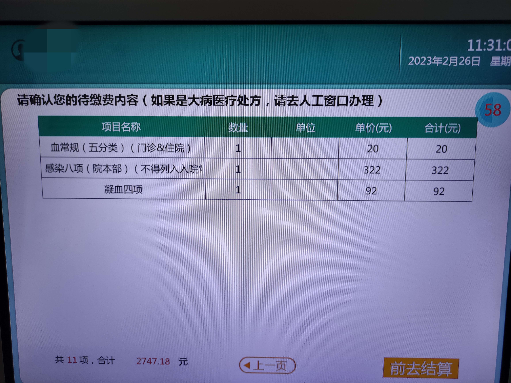
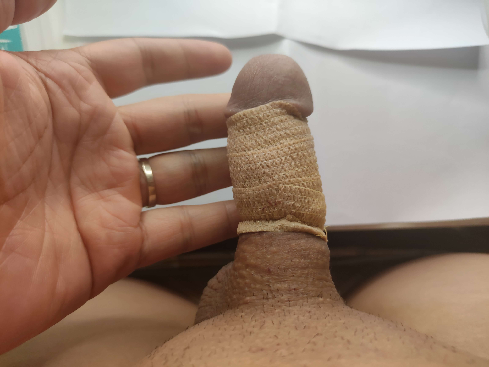

# GeBaoPi
我的割包皮日志  My Circumcision Plog

## 介绍
本人前段时间想割包皮，发现网上关于割包皮的相关信息不多，故将自己割包皮的过程以及恢复过程以图片的方式分享出来，希望对你有所帮助。

+ 医院：南方医科大学深圳医院
+ 医生：周青春
+ 手术时间：2023年3月3日
+ 全部费用：2990=2747+125+56+62
> 其中
> 1. 手术和前期药物费用：2747元 其中 191自费 2556元扣医保个人账户余额（非统筹账户）
> 2. 挂号费：125元 挂号 3次 其中两次挂的周医生的号50元一次，一次挂了另一个医生的号 25元
> 3. 换敷料纱布：56元，一共换了两次，每次28元
> 4. 恢复期药物:62元，医生开了高锰酸钾片和红霉素软膏

+ 感受：医院环境很好，医生幽默风趣
+ 教训：拆敷料纱布那天别穿宽松内裤，不然JJ左右晃动会变成狒狒屁股

## 链接

1. 从收费详情中看到医院吻合器的供应厂家是常熟亨利，在官网找到了[手术演示视频](http://www.henry-hu.cn/video)
2. [Telegram交流群](https://t.me/gebaopi_group)

## 图片

### 割包皮前

### 手术收费单

### 手术当天

### day1
术后第一天

### day2

术后第二天

### day3

术后第三天

### day4

术后第四天

### day5

术后第五天

### day6

术后第六天

### day7

术后第七天

### day8

术后第八天

### day9

术后第九天

### day10

术后第十天

### day11

术后第十一天

### day12

术后第十二天

### day13

术后第十三天

### day14
### day15

